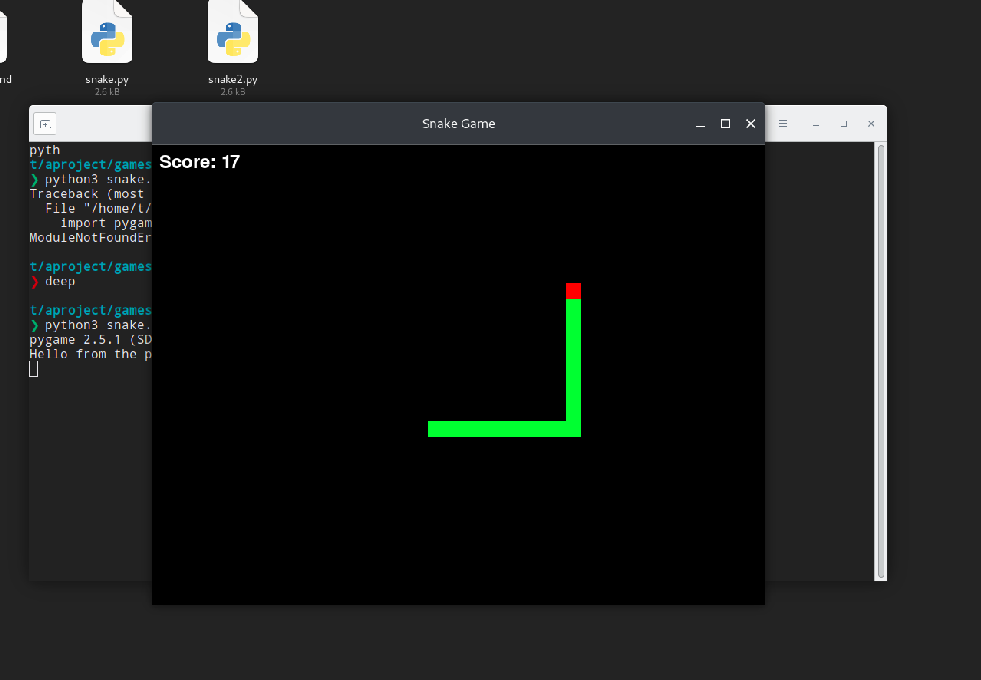

# Snake Game 
Welcome to the Snake Game! 🐍

This is a simple snake game implemented in Python using the Pygame library. It's a classic game where you control a snake and try to eat apples while avoiding collision with the walls and yourself.

## How to Play
1. **Install Pygame**: Make sure you have Pygame installed. If not, you can install it using pip:

    ```
    pip install pygame
    ```

2. **Run the Game**: Execute the snake_game.py script in your Python environment.
    ```
    python3 snake.py  
    ```
    or 
    ```
    python3 snake2.py
    ```

3. **Game Rules**:

    * Use the arrow keys (Up, Down, Left, Right) to control the snake's direction.
    * Your goal is to eat as many apples as possible to increase your score.
    * The game ends if the snake collides with the walls or itself.

4. **Scoring**: Each apple you eat increases your score.

5. **Game Over**: When the game ends, you will see a "Game Over" message along with your score.

6. **Restart**: You can play again by running the game script once more.


## Controls
* **Up Arrow**: Move the snake up.
* **Down Arrow**: Move the snake down.
* **Left Arrow**: Move the snake left.
* **Right Arrow**: Move the snake right.

## Customization
Feel free to customize the game by adjusting the constants in the code:

* `WIDTH` and `HEIGHT`: Set the dimensions of the game window.
* `GRID_SIZE`: Adjust the size of the grid.
* `WHITE`, `GREEN`, and `RED`: Change the colors used for the snake, apple, and background.
* `clock.tick(10)`: Modify the game speed by changing the tick rate.

## Acknowledgments
This game was created with love by Tikendra(me). Have fun playing! 🎮

## Issues and Contributions
If you encounter any issues or have suggestions for improvements, please open an issue or submit a pull request on the GitHub repository [link to GitHub repository].

## License
Not for commercial use. :haha jk.
This Snake Game is open-source. Feel free to use and modify it for your own projects.

Enjoy the game, and happy coding! 🎉🐍